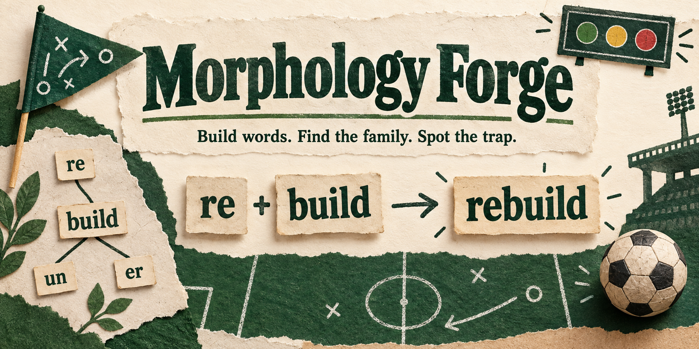

# Morphology Forge

**A word-building game with a football scoreboard, useful hints, and room to think.** Build a word from its pieces, work out a related word, or spot a spelling trap.

- **[Play in your browser](https://jessemaddox.com/projects/morphology-forge/play/)**
- **[Download the complete offline game](https://github.com/jessecmaddox3/morphology-forge/releases/download/v1.0.1/Morphology-Forge.html)**

I built this for me and my personal use, then cleaned it up so other people could use the whole thing. Make it your own, and feel free to improve mine. Hopefully it gives you a useful starting point, or at the very least some ideas. Cheers!

## Start here, even if you do not use GitHub

Click **Play in your browser** and start playing. No account, subscription, AI service or setup is needed. The game starts with a local learner called **Player 1**. Open **Learners and backups** to add your own nickname or switch learners.

For a copy you can keep:

1. Click **Download the complete offline game** above. It saves a file called `Morphology-Forge.html`, usually in Downloads. You do not need a GitHub account or the green Code button.
2. Find that file and double-click it. It opens in your web browser. If your browser displays it instead of downloading it, use its Download or Save link option.
3. Play. Keep using the same file and browser. Export a backup before moving the file, changing browsers or clearing browser data.

The single downloaded file includes the full game, teaching bank, styles and license notices. It makes no outside requests. If your browser cannot save progress, the game clearly says **Temporary session**; you can still play and export before leaving.

## Three ways to play

- **Build-up play:** choose chips in order to build the word described by a clue. A first wrong assembly gets a retry before it counts as a missed answer.
- **Through ball:** use a root and the surrounding pieces to work out a word’s meaning. Answers shuffle, so their position is never the lesson.
- **Offside call:** decide whether a word sum or family connection is real. `unhappy` belongs with `happy`; `uncle` is a different story. Historical family questions are clearly distinguished from literal word sums.

The complete bank contains **17 roots, 62 build targets, 18 inference questions and 14 relation cards**, across three editorial difficulty levels. Every root has both a build and inference route. A Goal means showing a root in both ways without hints, rather than repeating one question until a counter fills up.

Ask the coach whenever you need help. Hints show useful structure and related examples. Assisted answers still receive feedback and count in answer statistics, but they cannot raise the placement ceiling or establish mastery. Three initial questions look for a starting level; later practice mixes material up to a moving ceiling and offers an easier question after a miss.

**Turn off “Move on after a correct answer” to read at your own pace.** Next remains available after either result. Correct explanations are just as useful as corrections.

## Your progress stays yours

Learners have separate local progress and random IDs. A nickname is a label, not an account. Export creates a readable JSON backup; Import creates a new local learner without replacing an existing one. Exports contain no cloud credentials or account bindings.

Competing tabs cannot silently overwrite each other. A losing attempt is preserved for recovery, and an unsaved copy can be exported. Unreadable future-version saves remain exportable. Browser storage is not encryption: someone using the same browser can see its learners and backups.

Optional cloud saves require a host to configure its own backend and an adult to sign in explicitly by email code. The destination is shown first. Once connected, local saves upload automatically; other devices can preview and restore them. Authentication stays in page memory, and reloads require a new sign-in. [Host setup and data boundaries](docs/cloud-setup.md). The downloaded HTML keeps cloud disabled.

## Make it yours

Use, modify, share or sell your version under the [MIT license](LICENSE). Keep the license and [dependency notices](public/THIRD_PARTY_NOTICES.txt) with copies. Contributions and corrections are welcome.

| What you want to change | Where to start |
| --- | --- |
| Word families, clues, hints and explanations | `public/data.js` and [content notes](docs/content.md) |
| Placement, adaptive practice and mastery | `public/engine.js` |
| Game interactions and feedback | `public/app.js` |
| The football theme | `public/morphology.css` |
| Local profiles, backups and optional cloud | `public/shared/` and [design notes](docs/design.md) |
| Give an AI assistant a useful starting point | `skills/adapt-morphology-forge/SKILL.md` |

For source editing, install [Node.js](https://nodejs.org/) version 22 or later. Download and extract the [source ZIP](https://github.com/jessecmaddox3/morphology-forge/releases/download/v1.0.1/morphology-forge-1.0.1-source.zip), open a terminal in that folder, then run:

```sh
npm ci --ignore-scripts
npm run build
npm start
```

Open the local address printed in the terminal. The build creates `artifacts/Morphology-Forge.html` and the ready-to-host `public/` folder. Hosting under a repository subpath is supported. The source ZIP includes generated files, so you can also try `public/index.html` directly before installing developer tools.

## Development

```sh
npm test
python3 -m pip install playwright==1.58.0
python3 -m playwright install chromium
python3 scripts/test-browser.py
python3 scripts/test-saves-browser.py
```

[Verification and limits](docs/verification.md), [contributing](CONTRIBUTING.md), [security reporting](SECURITY.md), and [source and asset provenance](docs/provenance.md).

This is an original, AI-assisted personal project and teaching bank. It is not a validated curriculum or a promise of educational results. The banner was generated with ChatGPT. Playing requires no AI, tokens, API key or paid account.
